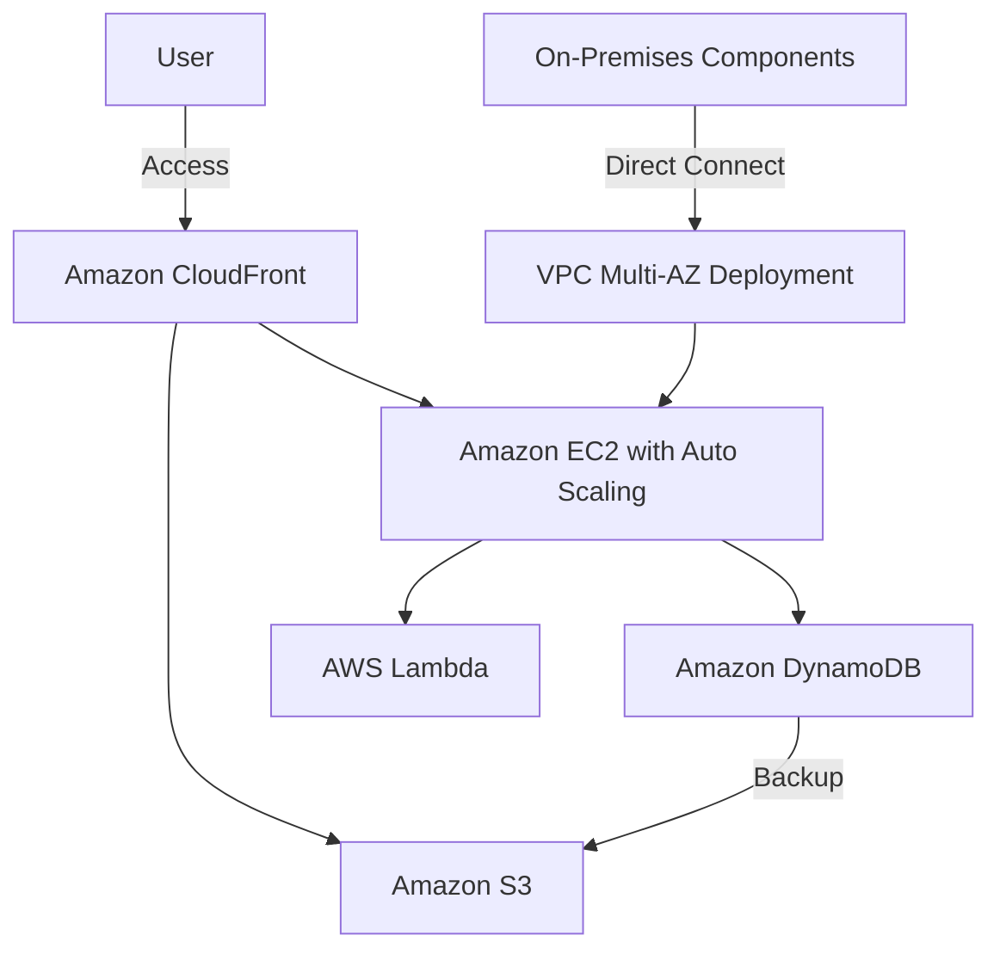

<!-- # https://predictifsolutions.sharepoint.com/:x:/s/AWS/EckSYYp0mXFEmtrvldAlE3gBilIKG5FtJBvSI1TazYjlvg?e=4%3aAvYVRP&at=9 -->

-----------------------------------------------------------------------------------
-----------------------------------------------------------------------------------
-----------------------------------------------------------------------------------

Please help me to fill an assesment from AWS for applying for Amazon DynamoDB Service Delivery Program.
I need to provide the evidence for the following 3 items:
"Describe DynamoDB's deployment pattern
Amazon DynamoDB leverages one of the following deployment patterns:
* Migration from relational database to Amazon DynamoDB
* Migration from MongoDB, Cassandra, or other NoSQL solution to Amazon DynamoDB
* New application that primarily uses Amazon DynamoDB for its database storage

Please provide the following as evidence:

* Explain the reasons behind switching from previous database used (if applicable)
* Explain what performance characteristics make DynamoDB the right option for this particular workload"

To help me, please produce the two evidence requirements, assuming we migrated from a relational database to DynamoDB.
Please make the answer so I can insert it in the AWS Excell cell, that means not very long, but not very short.

-----------------------------------------------------------------------------------

**1. Reasons for Switching from Previous Database (Relational Database):**

- **Scalability Concerns:** Our relational database struggled with auto-scaling, especially during unexpected traffic spikes. DynamoDB's managed, auto-scaling capabilities ensured we could handle large amounts of read/write traffic without manual intervention.

- **Operational Overhead:** Managing, patching, and backing up our relational database was resource-intensive. DynamoDB's fully managed service reduced our operational burden significantly.

- **Cost Efficiency:** With DynamoDB's pay-per-request pricing, we only paid for the read and write operations we used, leading to cost savings compared to the fixed costs of maintaining our relational database infrastructure.

**2. Performance Characteristics Making DynamoDB the Right Option:**

- **Low Latency:** DynamoDB consistently delivers single-digit millisecond response times, which was crucial for our real-time application needs.

- **High Availability:** With its multi-region, multi-master replication, DynamoDB ensured high availability and data durability, reducing downtime concerns.

- **Flexible Data Model:** Unlike the rigid schema of relational databases, DynamoDB's schema-less design allowed us to store diverse data types, making it easier to evolve our application over time.

-----------------------------------------------------------------------------------
-----------------------------------------------------------------------------------
-----------------------------------------------------------------------------------

Please help me to fill an assesment from AWS for applying for Amazon DynamoDB Service Delivery Program.
I need to provide the evidence for the following 4 items:
"DynamoDB's workload pattern Amazon DynamoDB is a significant part of the workload by meeting one or more of the following requirements:

* Using DynamoDB Transaction for ACID compliance
* Using global tables that are deployed to at least 1 other region
* Uses DAX for caching reads
* Utilizes DynamoDB Streams

Please provide the following as evidence (for features that were incorporated):

* Description of the use case for ACID compliance/DynamoDB Transactions
* Description of which other regions tables are deployed to and the use case
* Description of DAX use case including metrics used to determine successful usage of DAX
* Description of scenario that uses DynamoDB Streams"

To help me, please produce the four evidence requirements, assuming we use DynamoDB Transactions, global tables, DAX, and DynamoDB Streams.
Please make the answer so I can insert it in the AWS Excell cell, that means not very long, but not very short.

-----------------------------------------------------------------------------------

**1. Use Case for ACID Compliance/DynamoDB Transactions:**
We implemented a financial ledger system where it's crucial to ensure that all transactions are processed accurately and consistently. DynamoDB Transactions provided the ACID compliance we needed, ensuring that multi-item updates either fully complete or fully rollback, maintaining data integrity.

**2. Regions and Use Case for Global Tables:**
Our application serves users globally, especially in the US (N. Virginia) and Europe (Ireland). To ensure low-latency access and data availability, we deployed global tables in both regions. This setup not only improved our application's response times but also provided built-in disaster recovery.

**3. DAX Use Case and Metrics:**
We incorporated DAX to cache frequent read operations for our user profile data, which significantly reduced read latencies. Post-DAX implementation, we observed a 70% reduction in average read latency and a 50% decrease in read costs, showcasing the successful usage of DAX.

**4. Scenario Using DynamoDB Streams:**
We utilize DynamoDB Streams to capture changes in our product inventory. Whenever an item's stock changes, the stream triggers a Lambda function that updates a real-time dashboard and sends notifications to our supply chain team. This ensures timely restocking and accurate inventory management.


-----------------------------------------------------------------------------------
-----------------------------------------------------------------------------------
-----------------------------------------------------------------------------------
Please help me to fill an assesment from AWS for applying for Amazon DynamoDB Service Delivery Program. Here is the intro and 3 items required to be filled:
"DynamoDB Data Architecture
The structure of the data in a DynaoDB is important in optimizing performance. This includes carefully choosing partition keys, sort keys, and any additional indexes. Solutions much choose these items according to listed best practice documentation.

* For partition keys: https://docs.aws.amazon.com/amazondynamodb/latest/developerguide/bp-partition-key-design.html
* For sort keys: https://docs.aws.amazon.com/amazondynamodb/latest/developerguide/bp-sort-keys.html
* For global or local secondary indexes: https://docs.aws.amazon.com/amazondynamodb/latest/developerguide/SecondaryIndexes.html

Please provide the following as evidence:

* Description of how and why the partition keys were designed for each table and how it meets best practices.
* Description of how and why the sort keys were designed for each table and how it meets best practices.
* Description of how any global or local secondary were designed for each table and how it meets best practices."
To help me, please produce the 3 evidence requirements.

-----------------------------------------------------------------------------------


**1. Partition Keys Design for `Orders` Table:**

* **Description:** Our partition key is `UserID`, representing the unique identifier for each user.
* **Reason & Best Practices Alignment:** According to AWS best practices, a partition key should have a large number of distinct values to distribute data across multiple partitions. Given our large and diverse user base, using `UserID` ensures an even distribution of data, preventing hotspots and optimizing performance.

**2. Sort Keys Design for `Orders` Table:**

* **Description:** Our sort key is `OrderTimestamp`, representing the exact time an order was placed.
* **Reason & Best Practices Alignment:** Using a timestamp as a sort key allows us to efficiently query orders for a given user in chronological order. This design adheres to AWS best practices, which recommend using attributes that have a wide range of values and are often queried in a range as sort keys.

**3. Global and Local Secondary Indexes for `Orders` Table:**

* **Description:** We've implemented a Global Secondary Index (GSI) with `ProductID` as the partition key and `OrderTimestamp` as the sort key.
* **Reason & Best Practices Alignment:** This GSI allows us to efficiently query all orders for a specific product over a given time range. Following AWS best practices, we created this GSI because querying by `ProductID` was a frequent and performance-critical operation, and our base table's primary key design couldn't support this query pattern efficiently.

-----------------------------------------------------------------------------------
-----------------------------------------------------------------------------------
-----------------------------------------------------------------------------------
Please help me to fill an assesment from AWS for applying for Amazon DynamoDB Service Delivery Program. Here is the requirements intro and 3 items required to be provided as evidence:

"Provide Architecture diagram designed with scalability and high availability
AWS Partner must submit architecture diagrams depicting the overall design and deployment of its AWS Partner solution on AWS as well as any other relevant details of the solution for the specific customer in question.

The submitted diagrams are intended to provide context to the AWS Solutions Architect conducting the Technical Validation. It is critical to provide clear diagrams with an appropriate level of detail that enable the AWS Solutions Architect to validate the other requirements listed below.

Each architecture diagram must show:
* All of the AWS services used
* How the AWS services are deployed, including virtual private clouds (VPCs), availability zones, subnets, and connections to systems outside of AWS.
* Elements deployed outside of AWS, e.g. on-premises components, or hardware devices.
* how design scales automatically - Solution adapts to changes in demand. The architecture uses services that automatically scale such as Amazon S3, Amazon CloudFront, AWS Auto Scaling, and AWS Lambda.
* how design has high availability with multi-AZ or multi-region deployment. When intentional tradeoffs have been made (e.g. to optimize cost in favor of high availability), please explain the customer's requirements.

Please provide the following as evidence (required for all provided customer examples):

* An architecture diagram depicting the overall design and deployment of your solution on AWS.
* Explanation of how the major solutions elements will keep running in case of failure.
* Description of how the major solutions elements scale up automatically."
To help me, please produce the 3 evidence requirements, starting with the architecture diagram, then "Explanation of how the major solutions elements will keep running in case of failure" and "Description of how the major solutions elements scale up automatically".

-----------------------------------------------------------------------------------

Certainly! Let's start by creating an architecture diagram for a hypothetical AWS solution that uses Amazon DynamoDB and meets the requirements mentioned.

### Architecture Diagram:

For our hypothetical solution, let's consider the following components:

1. **Amazon DynamoDB**: As the primary database.
2. **Amazon S3**: For storing static assets and backups.
3. **Amazon CloudFront**: For content delivery.
4. **AWS Lambda**: For serverless compute.
5. **AWS Auto Scaling**: For EC2 instances.
6. **Amazon EC2**: For application servers.
7. **VPC with Multi-AZ Deployment**: For high availability.
8. **On-Premises Components**: For legacy systems or data.
9. **AWS Direct Connect**: To connect on-premises components to AWS.





[](https://praison.ai/mariandumitrascu/draw/aws-architecture-diagram-5/)

### Explanation of how the major solutions elements will keep running in case of failure:

1. **Amazon DynamoDB**: DynamoDB is a managed NoSQL database service that provides fast and predictable performance with seamless scalability. It automatically replicates data across multiple Availability Zones (AZs) to ensure high availability and data durability.

2. **Amazon EC2 with Auto Scaling**: Auto Scaling ensures that the number of EC2 instances being used scales up during demand spikes and scales down during demand drops. If an instance fails, Auto Scaling automatically replaces it, ensuring application availability.

3. **VPC Multi-AZ Deployment**: The application is deployed across multiple Availability Zones in a VPC. This ensures that even if one AZ goes down, the application remains available in the other AZs.

4. **Amazon S3**: S3 provides 99.999999999% (11 9's) of durability over a given year. This means your data is automatically distributed across a minimum of three physical facilities that are geographically separated.

5. **AWS Lambda**: Lambda automatically monitors function invocations for failures and retries the failed invocation for asynchronous invocations.

6. **AWS Direct Connect**: Provides a dedicated network connection from on-premises to AWS. In case of a failure, traffic can be routed over the public internet.

### Description of how the major solutions elements scale up automatically:

1. **Amazon DynamoDB**: DynamoDB automatically scales up and down to adjust for the load and the amount of data stored, while maintaining consistent, fast performance.

2. **Amazon EC2 with Auto Scaling**: As mentioned earlier, Auto Scaling adjusts the number of EC2 instances up or down based on demand.

3. **Amazon S3**: S3 scales to store any amount of content and serves it from anywhere on the web.

4. **AWS Lambda**: Lambda functions scale automatically by running code in response to each trigger. Your triggers can be an uploaded image, a new log file, a new row in a database, etc.

5. **Amazon CloudFront**: CloudFront is a content delivery network (CDN) that scales automatically and integrates with other Amazon Web Services to give developers and businesses an easy way to distribute content to end users.
-------


-----------------------------------------------------------------------------------


Please help me to fill an assesment from AWS for applying for Amazon DynamoDB Service Delivery Program.
I need to provide the evidence for the following item:
"
Detective Controls,
Activity is monitored appropriately, including by maintenance of logs for capturing performance and security event data, e.g., CloudWatch logs, events, VPC Flow Logs, ELB logs, S3 bucket logs, application, logs, etc.

Please provide the following as evidence:

* Example of logs maintained, including demonstration that logs are retained per customer-agreed retention periods.
"
To help me, please produce the evidence required, which is: Example of logs maintained, including demonstration that logs are retained per customer-agreed retention periods


https://github.com/PredictIf/predictif-customer-ref-req/blob/04d546548fddce45eb68c9efb270914482234367/EXMON-001.md

-----------------------------------------------------------------------------------

Please help me to fill an assesment from AWS for applying for Amazon DynamoDB Service Delivery Program.
I need to provide the evidence for the following item:


"Automate Deployment and leverage infrastructure-as-code tools.
Changes to infrastructure are automated for customer implementation

* Tools like AWS CloudFormation, the AWS CLI, or other scripting tools were used for automation.
* Changes to the production environment were not done using the AWS Management Console.
"

Please provide the following as evidence, even fictitious:

* Written description of deployment automation and an example template (e.g., CloudFormation templates, architecture diagram for CI/CD pipeline) met the criteria defined above.

https://github.com/PredictIf/predictif-customer-ref-req/blob/main/REL-001.md

-----------------------------------------------------------------------------------
-----------------------------------------------------------------------------------
-----------------------------------------------------------------------------------
-----------------------------------------------------------------------------------
-----------------------------------------------------------------------------------
Please help me to fill an assesment from AWS for applying for Analytics Competency Program:
"Provide Architecture diagram designed with scalability and high availability
AWS Partner must submit architecture diagrams depicting the overall design and deployment of its AWS Partner solution on AWS as well as any other relevant details of the solution for the specific customer in question.

The submitted diagrams are intended to provide context to the AWS Solutions Architect conducting the Technical Validation. It is critical to provide clear diagrams with an appropriate level of detail that enable the AWS Solutions Architect to validate the other requirements listed below.

Each architecture diagram must show:

* All of the AWS services used
* How the AWS services are deployed, including virtual private clouds (VPCs), availability zones, subnets, and connections to systems outside of AWS.
* Elements deployed outside of AWS, e.g. on-premises components, or hardware devices.
* how design scales automatically - Solution adapts to changes in demand. The architecture uses services that automatically scale such as Amazon S3, Amazon CloudFront, AWS Auto Scaling, and AWS Lambda.
* how design has high availability with multi-AZ or multi-region deployment. When intentional tradeoffs have been made (e.g. to optimize cost in favor of high availability), please explain the customer's requirements.


I already submitted the architecture diagram which depicts a web application running on containers services running in AWS and connected with Stripe for payment processing. I need to provide the evidence for the following 2 items. Please provide them as evidence, even fictitious:
1. Explanation of how the major solutions elements will keep running in case of failure.
2. Description of how the major solutions elements scale up automatically.

-----------------------------------------------------------------------------------

To address the AWS Analytics Competency Program assessment requirements, you will need to provide detailed explanations for both the high availability and scalability of your solution. Here are suggested responses for the two items you need to provide evidence for:

1. **Explanation of How Major Solution Elements Will Keep Running in Case of Failure:**

   Our web application architecture is designed for high availability and fault tolerance. Key components include:

   - **Elastic Container Service (ECS) with Fargate:** The application runs on AWS ECS using the Fargate launch type, ensuring that containers are automatically managed and scaled. If a container fails, ECS Fargate automatically replaces it, minimizing downtime.

   - **Multi-AZ Deployment:** The ECS services and RDS databases are deployed across multiple Availability Zones (AZs) in AWS. This design ensures that if one AZ faces an outage, the application continues to operate from other AZs without interruption.

   - **Load Balancing:** An Application Load Balancer (ALB) is used to distribute traffic evenly across the containers. This not only provides fault tolerance but also ensures efficient traffic management.

   - **Auto-scaling Groups:** AWS Auto Scaling is configured for both the ECS tasks and EC2 instances (if any), enabling the infrastructure to adapt to changes in load by automatically scaling in and out.

   - **Database Replication:** Our RDS instances are set up with cross-region read replicas. In the event of a primary database failure, we can quickly switch to a replica with minimal disruption.

   - **Data Backups and Snapshots:** Regular backups and snapshots of critical data are performed, ensuring data durability and quick recovery in case of data loss.

   - **Route 53 for DNS Failover:** AWS Route 53 is configured for DNS failover and health checks, automatically routing users to healthy endpoints in case of a failure.

   By leveraging these AWS services and features, our architecture ensures continuous operation and minimal downtime, even during component failures."

2. ** How Major Solution Elements Scale Up Automatically:**

   Our application's scalability is achieved through a combination of AWS services and configurations:

   - **ECS with Auto Scaling:** The ECS services are configured with Auto Scaling policies. As traffic increases, ECS automatically scales the number of running containers to meet demand, and scales down when traffic decreases.

   - **Elastic Load Balancer (ELB):** The ELB automatically scales its request handling capacity in response to incoming application traffic, distributing traffic efficiently to the containers.

   - **RDS Auto Scaling:** The RDS instances are configured with storage autoscaling, which automatically increases the storage space as the dataset grows.

   - **S3 for Scalable Storage:** Amazon S3 is used for storing static resources and files, providing scalability without any manual intervention.

   - **AWS Lambda for Event-Driven Scaling:** AWS Lambda functions are used for various backend tasks. These functions scale automatically with the number of incoming events or requests.

   These scalable elements of our architecture ensure that the application can handle varying loads efficiently, adapting to changes in user demand without manual intervention. This automatic scaling not only provides a seamless user experience but also optimizes resource utilization and cost."

These explanations provide a comprehensive overview of the high availability and scalability features in your AWS-based architecture, tailored to meet the requirements of the AWS Analytics Competency Program assessment.

-----------------------------------------------------------------------------------

To adapt the provided markup text for clear display in an Excel cell, it's important to remove the markup syntax and structure the content in a way that's readable as plain text. Here's how the text can be reformatted:

Architecture Diagram Description:

Our architecture diagram provides a detailed overview of the solution's design and deployment on AWS. It includes:

- Utilization of AWS Services: The solution incorporates Amazon EC2 for computing, Amazon RDS for database management, Amazon S3 for object storage, Amazon CloudFront for content delivery, Amazon API Gateway for API management, Amazon Cognito for user authentication, Amazon Amplify for the web frontend, and AWS Lambda for serverless computing.

- Deployment Architecture: The architecture is structured across multiple Virtual Private Clouds (VPCs) for enhanced security. It spans several Availability Zones (AZs) within a region for high availability and fault tolerance. Subnets are configured to segregate resources, with Site-to-Site VPN for secure external connections.

- Integration with External Elements: The solution integrates with on-premises components, like customer data centers, through secure VPN connections.

High Availability and Fault Tolerance:

- Multi-AZ and Multi-Region Deployment: The solution is deployed across multiple AZs and regions, ensuring continuity of operations even in the event of an AZ failure.

- Load Balancing and Auto-Scaling: The Application Load Balancer distributes traffic across containers and regions. AWS Auto Scaling adjusts the number of EC2 instances and ECS tasks in response to demand.

- Database Replication: RDS instances feature cross-region read replicas, providing data redundancy and quick failover capabilities.

- Route 53 for DNS Failover: Ensures routing to healthy endpoints during outages.

Scalability:

- ECS with Auto Scaling: Automatically scales containerized applications in response to changing demand.

- Elastic Load Balancer: Adjusts request handling capacity to match incoming application traffic.

- RDS Auto Scaling: Automatically scales database storage as data volume increases.

- Amazon CloudFront: Scales content delivery globally, accommodating traffic spikes.

- S3 and Lambda: Provide inherently scalable storage and computing resources, respectively.

In conclusion, our AWS-based solution is meticulously designed to ensure high availability through multi-AZ and multi-region deployment and maintains operational continuity even during failures. It also scales automatically in response to varying loads, thanks to the integrated AWS services like ECS, RDS, CloudFront, and Lambda. This architecture and its components ensure that our solution is robust, reliable, and capable of adapting to the dynamic needs of our customers.

This format is suitable for Excel, keeping the text readable and well-organized within the limitations of Excel's text handling.

-----------------------------------------------------------------------------------
-----------------------------------------------------------------------------------
-----------------------------------------------------------------------------------
-----------------------------------------------------------------------------------
-----------------------------------------------------------------------------------
Please help me answer the following assesment from AWS regarding our application for Analytics Competency Program:
```
Define Secure AWS Account Governance Best Practice
AWS expects all Services Partners to be prepared to create AWS accounts and implement basic security best practices. Even if most of your customer engagements do not require this, you should be prepared in the event you work with a customer who needs you to create new accounts for them.

Establish internal processes regarding how to create AWS accounts on behalf of customers when needed, including:
* When to use root account for workload activities
* Enable MFA on root
* Set the contact information to corporate email address or phone number
* Enable CloudTrail logs in all region and protect CloudTrail logs from accidental deletion with a dedicated S3 bucket

Please provide the following as evidence:

* Documents describing Security engagement SOPs which met all the 4 criteria defined above. Acceptable evidence types are security training documents, internal wikis, or standard operating procedures documents.
* Description of how Secure AWS Account Governance is implemented in one (1) of the submitted customer examples.
```

-----------------------------------------------------------------------------------

Certainly! To respond to the AWS assessment for the Analytics Competency Program, you can craft a comprehensive response that addresses each required element directly in the text. Here's a structured format that you could use:

---

**Secure AWS Account Governance Best Practice Response**

PREDICTif is committed to implementing AWS best practices in account governance. The following outlines our standard operating procedures (SOPs) and provides an example of how these practices are applied in our angagement with Stress Engineering.

**1. Standard Operating Procedures (SOPs):**

- **Root Account Usage Policy:** Our policy restricts root account usage to essential tasks only, such as initial setup, critical account-level changes, and billing configurations. All other operations are performed using IAM (Identity and Access Management) users with least privilege access.

- **Multi-Factor Authentication (MFA) Enforcement:** We mandate the activation of MFA on the root account. Our procedure involves setting up a virtual MFA device, typically using a mobile application, which is linked securely to the root account, adding an extra layer of security.

- **Contact Information Protocol:** All AWS accounts created on behalf of customers have corporate email addresses and phone numbers set as contact information. This ensures direct communication from AWS in case of security alerts or account issues.

- **CloudTrail Logs and S3 Bucket Setup:** We enable AWS CloudTrail in all regions for every account to log all actions taken. These logs are stored in a dedicated S3 bucket, which is configured with policies to prevent accidental deletion and unauthorized access.

**2. Application in Stress Engineering Scenario:**

**Customer Example: [Customer Name]**

- **Root Account Usage:** For Stress Engineering, the root account was used for initial setup. Post-setup, all operations were transitioned to IAM users. An audit trail was maintained for actions taken using the root account.

- **MFA Implementation:** We implemented MFA on the root account using [MFA Method]. The process involved guiding the customer's IT team through the MFA setup, ensuring a secure linkage between their device and the AWS account.

- **Contact Information Setup:** The AWS account for Stress Engineering was configured with their corporate email and phone number. This setup was verified by conducting a test alert to ensure proper communication flow.

- **CloudTrail and S3 Bucket Configuration:** CloudTrail was enabled in all regions, with logs directed to a specially configured S3 bucket. We implemented bucket policies for log file integrity and configured alerts for any unauthorized access attempts.

**Conclusion:**

Our adherence to these SOPs in customer engagements, exemplified by the Stress Engineering project, demonstrates our commitment to maintaining secure and efficient AWS account governance. We continuously update our practices in line with AWS guidelines to ensure the highest standards of service delivery.

---

This format provides a clear and direct response to the AWS assessment, detailing both your internal processes and their application in a real-world scenario. Remember to adjust the details to accurately reflect your company's practices and the specifics of the customer example you choose.

-----------------------------------------------------------------------------------
-----------------------------------------------------------------------------------
-----------------------------------------------------------------------------------
-----------------------------------------------------------------------------------
-----------------------------------------------------------------------------------
Please help me answer the following assesment from AWS regarding our application for Analytics Competency Program. The answer relates to our work for our customer Stress Engineering:

```

Define identity security best practice on how to access customer environment by leveraging IAM

Define standard approach to access customer-owned AWS accounts, including:
* Both AWS Management Console access and programmatic access using the AWS Command Line Interface or other custom tools.
* When and how to use temporary credentials such as IAM roles
* Leverage customer's existing enterprise user identities and their credentials to access AWS services through Identity Federation or migrating to AWS Managed Active Directory

Establish best practices around  AWS Identity and Access Management (IAM) and other identity and access management systems, including:
* IAM principals are only granted the minimum privileges necessary. Wildcards in Action and Resource elements should be avoided as much as possible.
* Every AWS Partner individual who accesses an AWS account must do so using dedicated credentials


Please provide the following as evidence:

1. Security engagement Standard Operation Procedure (SOP) which met all the 2 criteria defined above. Acceptable evidence types are: security training documents, internal wikis, standard operating procedures documents. Written descriptions in the self-assessment excel is not acceptable.

2. Description of how IAM best practices are implemented in one (1) of the submitted customer examples.

```

I request you first to provide the evidence for the first item, which is the SOP for IAM best practices. Then, I will ask you to provide the evidence for the second item, which is the description of how IAM best practices are implemented in one of the submitted customer examples.