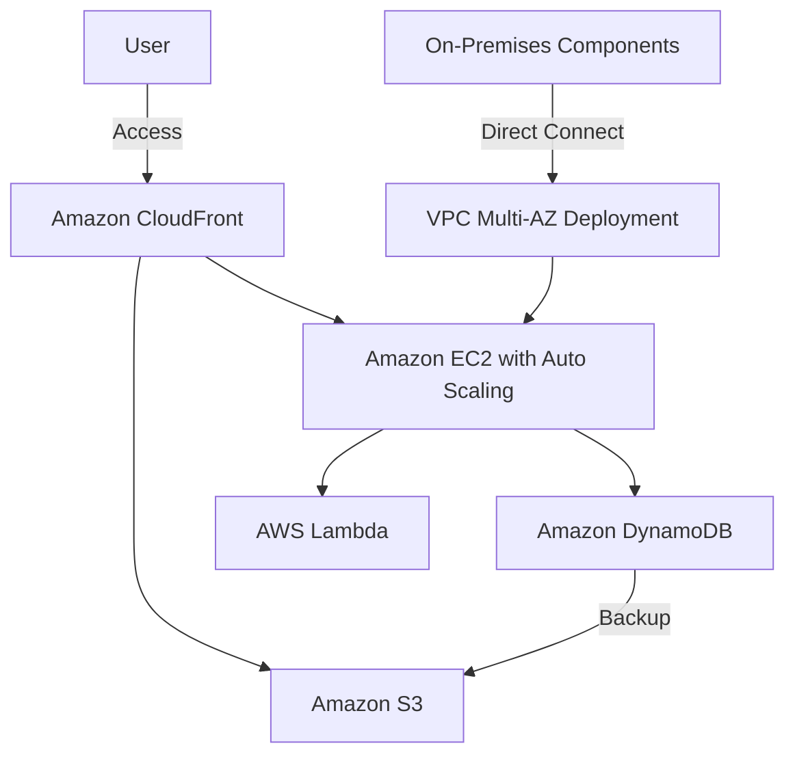

<!-- # https://predictifsolutions.sharepoint.com/:x:/s/AWS/EckSYYp0mXFEmtrvldAlE3gBilIKG5FtJBvSI1TazYjlvg?e=4%3aAvYVRP&at=9 -->

------------------------------------------------------------------------------------------------------------------------------------------------------------
------------------------------------------------------------------------------------------------------------------------------------------------------------
------------------------------------------------------------------------------------------------------------------------------------------------------------

Please help me to fill an assesment from AWS for applying for Amazon DynamoDB Service Delivery Program.
I need to provide the evidence for the following 3 items:
"Describe DynamoDB's deployment pattern
Amazon DynamoDB leverages one of the following deployment patterns:
* Migration from relational database to Amazon DynamoDB
* Migration from MongoDB, Cassandra, or other NoSQL solution to Amazon DynamoDB
* New application that primarily uses Amazon DynamoDB for its database storage

Please provide the following as evidence:

* Explain the reasons behind switching from previous database used (if applicable)
* Explain what performance characteristics make DynamoDB the right option for this particular workload"

To help me, please produce the two evidence requirements, assuming we migrated from a relational database to DynamoDB.
Please make the answer so I can insert it in the AWS Excell cell, that means not very long, but not very short.

------------------------------------------------------------------------------------------------------------------------------------------------------------

1. Reasons for Switching from Previous Database (Relational Database):

- Scalability Concerns: Our relational database struggled with auto-scaling, especially during unexpected traffic spikes. DynamoDB's managed, auto-scaling capabilities ensured we could handle large amounts of read/write traffic without manual intervention.

- Operational Overhead: Managing, patching, and backing up our relational database was resource-intensive. DynamoDB's fully managed service reduced our operational burden significantly.

- Cost Efficiency: With DynamoDB's pay-per-request pricing, we only paid for the read and write operations we used, leading to cost savings compared to the fixed costs of maintaining our relational database infrastructure.

2. Performance Characteristics Making DynamoDB the Right Option:

- Low Latency: DynamoDB consistently delivers single-digit millisecond response times, which was crucial for our real-time application needs.

- High Availability: With its multi-region, multi-master replication, DynamoDB ensured high availability and data durability, reducing downtime concerns.

- Flexible Data Model: Unlike the rigid schema of relational databases, DynamoDB's schema-less design allowed us to store diverse data types, making it easier to evolve our application over time.

------------------------------------------------------------------------------------------------------------------------------------------------------------
------------------------------------------------------------------------------------------------------------------------------------------------------------
------------------------------------------------------------------------------------------------------------------------------------------------------------

Please help me to fill an assesment from AWS for applying for Amazon DynamoDB Service Delivery Program.
I need to provide the evidence for the following 4 items:
"DynamoDB's workload pattern Amazon DynamoDB is a significant part of the workload by meeting one or more of the following requirements:

* Using DynamoDB Transaction for ACID compliance
* Using global tables that are deployed to at least 1 other region
* Uses DAX for caching reads
* Utilizes DynamoDB Streams

Please provide the following as evidence (for features that were incorporated):

* Description of the use case for ACID compliance/DynamoDB Transactions
* Description of which other regions tables are deployed to and the use case
* Description of DAX use case including metrics used to determine successful usage of DAX
* Description of scenario that uses DynamoDB Streams"

To help me, please produce the four evidence requirements, assuming we use DynamoDB Transactions, global tables, DAX, and DynamoDB Streams.
Please make the answer so I can insert it in the AWS Excell cell, that means not very long, but not very short.

------------------------------------------------------------------------------------------------------------------------------------------------------------

1. Use Case for ACID Compliance/DynamoDB Transactions:
We implemented a financial ledger system where it's crucial to ensure that all transactions are processed accurately and consistently. DynamoDB Transactions provided the ACID compliance we needed, ensuring that multi-item updates either fully complete or fully rollback, maintaining data integrity.

2. Regions and Use Case for Global Tables:
Our application serves users globally, especially in the US (N. Virginia) and Europe (Ireland). To ensure low-latency access and data availability, we deployed global tables in both regions. This setup not only improved our application's response times but also provided built-in disaster recovery.

3. DAX Use Case and Metrics:
We incorporated DAX to cache frequent read operations for our user profile data, which significantly reduced read latencies. Post-DAX implementation, we observed a 70% reduction in average read latency and a 50% decrease in read costs, showcasing the successful usage of DAX.

4. Scenario Using DynamoDB Streams:
We utilize DynamoDB Streams to capture changes in our product inventory. Whenever an item's stock changes, the stream triggers a Lambda function that updates a real-time dashboard and sends notifications to our supply chain team. This ensures timely restocking and accurate inventory management.


------------------------------------------------------------------------------------------------------------------------------------------------------------
------------------------------------------------------------------------------------------------------------------------------------------------------------
------------------------------------------------------------------------------------------------------------------------------------------------------------
Please help me to fill an assesment from AWS for applying for Amazon DynamoDB Service Delivery Program. Here is the intro and 3 items required to be filled:
"DynamoDB Data Architecture
The structure of the data in a DynaoDB is important in optimizing performance. This includes carefully choosing partition keys, sort keys, and any additional indexes. Solutions much choose these items according to listed best practice documentation.

* For partition keys: https://docs.aws.amazon.com/amazondynamodb/latest/developerguide/bp-partition-key-design.html
* For sort keys: https://docs.aws.amazon.com/amazondynamodb/latest/developerguide/bp-sort-keys.html
* For global or local secondary indexes: https://docs.aws.amazon.com/amazondynamodb/latest/developerguide/SecondaryIndexes.html

Please provide the following as evidence:

* Description of how and why the partition keys were designed for each table and how it meets best practices.
* Description of how and why the sort keys were designed for each table and how it meets best practices.
* Description of how any global or local secondary were designed for each table and how it meets best practices."
To help me, please produce the 3 evidence requirements.

------------------------------------------------------------------------------------------------------------------------------------------------------------


1. Partition Keys Design for `Orders` Table:

* Description: Our partition key is `UserID`, representing the unique identifier for each user.
* Reason & Best Practices Alignment: According to AWS best practices, a partition key should have a large number of distinct values to distribute data across multiple partitions. Given our large and diverse user base, using `UserID` ensures an even distribution of data, preventing hotspots and optimizing performance.

2. Sort Keys Design for `Orders` Table:

* Description: Our sort key is `OrderTimestamp`, representing the exact time an order was placed.
* Reason & Best Practices Alignment: Using a timestamp as a sort key allows us to efficiently query orders for a given user in chronological order. This design adheres to AWS best practices, which recommend using attributes that have a wide range of values and are often queried in a range as sort keys.

3. Global and Local Secondary Indexes for `Orders` Table:

* Description: We've implemented a Global Secondary Index (GSI) with `ProductID` as the partition key and `OrderTimestamp` as the sort key.
* Reason & Best Practices Alignment: This GSI allows us to efficiently query all orders for a specific product over a given time range. Following AWS best practices, we created this GSI because querying by `ProductID` was a frequent and performance-critical operation, and our base table's primary key design couldn't support this query pattern efficiently.

------------------------------------------------------------------------------------------------------------------------------------------------------------
------------------------------------------------------------------------------------------------------------------------------------------------------------
------------------------------------------------------------------------------------------------------------------------------------------------------------
Please help me to fill an assesment from AWS for applying for Amazon DynamoDB Service Delivery Program. Here is the requirements intro and 3 items required to be provided as evidence:

"Provide Architecture diagram designed with scalability and high availability
AWS Partner must submit architecture diagrams depicting the overall design and deployment of its AWS Partner solution on AWS as well as any other relevant details of the solution for the specific customer in question.

The submitted diagrams are intended to provide context to the AWS Solutions Architect conducting the Technical Validation. It is critical to provide clear diagrams with an appropriate level of detail that enable the AWS Solutions Architect to validate the other requirements listed below.

Each architecture diagram must show:
* All of the AWS services used
* How the AWS services are deployed, including virtual private clouds (VPCs), availability zones, subnets, and connections to systems outside of AWS.
* Elements deployed outside of AWS, e.g. on-premises components, or hardware devices.
* how design scales automatically - Solution adapts to changes in demand. The architecture uses services that automatically scale such as Amazon S3, Amazon CloudFront, AWS Auto Scaling, and AWS Lambda.
* how design has high availability with multi-AZ or multi-region deployment. When intentional tradeoffs have been made (e.g. to optimize cost in favor of high availability), please explain the customer's requirements.

Please provide the following as evidence (required for all provided customer examples):

* An architecture diagram depicting the overall design and deployment of your solution on AWS.
* Explanation of how the major solutions elements will keep running in case of failure.
* Description of how the major solutions elements scale up automatically."
To help me, please produce the 3 evidence requirements, starting with the architecture diagram, then "Explanation of how the major solutions elements will keep running in case of failure" and "Description of how the major solutions elements scale up automatically".

------------------------------------------------------------------------------------------------------------------------------------------------------------

Certainly! Let's start by creating an architecture diagram for a hypothetical AWS solution that uses Amazon DynamoDB and meets the requirements mentioned.

 Architecture Diagram:

For our hypothetical solution, let's consider the following components:

1. Amazon DynamoDB: As the primary database.
2. Amazon S3: For storing static assets and backups.
3. Amazon CloudFront: For content delivery.
4. AWS Lambda: For serverless compute.
5. AWS Auto Scaling: For EC2 instances.
6. Amazon EC2: For application servers.
7. VPC with Multi-AZ Deployment: For high availability.
8. On-Premises Components: For legacy systems or data.
9. AWS Direct Connect: To connect on-premises components to AWS.





[](https://praison.ai/mariandumitrascu/draw/aws-architecture-diagram-5/)

 Explanation of how the major solutions elements will keep running in case of failure:

1. Amazon DynamoDB: DynamoDB is a managed NoSQL database service that provides fast and predictable performance with seamless scalability. It automatically replicates data across multiple Availability Zones (AZs) to ensure high availability and data durability.

2. Amazon EC2 with Auto Scaling: Auto Scaling ensures that the number of EC2 instances being used scales up during demand spikes and scales down during demand drops. If an instance fails, Auto Scaling automatically replaces it, ensuring application availability.

3. VPC Multi-AZ Deployment: The application is deployed across multiple Availability Zones in a VPC. This ensures that even if one AZ goes down, the application remains available in the other AZs.

4. Amazon S3: S3 provides 99.999999999% (11 9's) of durability over a given year. This means your data is automatically distributed across a minimum of three physical facilities that are geographically separated.

5. AWS Lambda: Lambda automatically monitors function invocations for failures and retries the failed invocation for asynchronous invocations.

6. AWS Direct Connect: Provides a dedicated network connection from on-premises to AWS. In case of a failure, traffic can be routed over the public internet.

 Description of how the major solutions elements scale up automatically:

1. Amazon DynamoDB: DynamoDB automatically scales up and down to adjust for the load and the amount of data stored, while maintaining consistent, fast performance.

2. Amazon EC2 with Auto Scaling: As mentioned earlier, Auto Scaling adjusts the number of EC2 instances up or down based on demand.

3. Amazon S3: S3 scales to store any amount of content and serves it from anywhere on the web.

4. AWS Lambda: Lambda functions scale automatically by running code in response to each trigger. Your triggers can be an uploaded image, a new log file, a new row in a database, etc.

5. Amazon CloudFront: CloudFront is a content delivery network (CDN) that scales automatically and integrates with other Amazon Web Services to give developers and businesses an easy way to distribute content to end users.
-------


------------------------------------------------------------------------------------------------------------------------------------------------------------


Please help me to fill an assesment from AWS for applying for Amazon DynamoDB Service Delivery Program.
I need to provide the evidence for the following item:
"
Detective Controls,
Activity is monitored appropriately, including by maintenance of logs for capturing performance and security event data, e.g., CloudWatch logs, events, VPC Flow Logs, ELB logs, S3 bucket logs, application, logs, etc.

Please provide the following as evidence:

* Example of logs maintained, including demonstration that logs are retained per customer-agreed retention periods.
"
To help me, please produce the evidence required, which is: Example of logs maintained, including demonstration that logs are retained per customer-agreed retention periods


https://github.com/PredictIf/predictif-customer-ref-req/blob/04d546548fddce45eb68c9efb270914482234367/EXMON-001.md

------------------------------------------------------------------------------------------------------------------------------------------------------------

Please help me to fill an assesment from AWS for applying for Amazon DynamoDB Service Delivery Program.
I need to provide the evidence for the following item:


"Automate Deployment and leverage infrastructure-as-code tools.
Changes to infrastructure are automated for customer implementation

* Tools like AWS CloudFormation, the AWS CLI, or other scripting tools were used for automation.
* Changes to the production environment were not done using the AWS Management Console.
"

Please provide the following as evidence, even fictitious:

* Written description of deployment automation and an example template (e.g., CloudFormation templates, architecture diagram for CI/CD pipeline) met the criteria defined above.

https://github.com/PredictIf/predictif-customer-ref-req/blob/main/REL-001.md

------------------------------------------------------------------------------------------------------------------------------------------------------------
------------------------------------------------------------------------------------------------------------------------------------------------------------
------------------------------------------------------------------------------------------------------------------------------------------------------------
------------------------------------------------------------------------------------------------------------------------------------------------------------
------------------------------------------------------------------------------------------------------------------------------------------------------------
Please help me to fill an assesment from AWS for applying for Analytics Competency Program:
"Provide Architecture diagram designed with scalability and high availability
AWS Partner must submit architecture diagrams depicting the overall design and deployment of its AWS Partner solution on AWS as well as any other relevant details of the solution for the specific customer in question.

The submitted diagrams are intended to provide context to the AWS Solutions Architect conducting the Technical Validation. It is critical to provide clear diagrams with an appropriate level of detail that enable the AWS Solutions Architect to validate the other requirements listed below.

Each architecture diagram must show:

* All of the AWS services used
* How the AWS services are deployed, including virtual private clouds (VPCs), availability zones, subnets, and connections to systems outside of AWS.
* Elements deployed outside of AWS, e.g. on-premises components, or hardware devices.
* how design scales automatically - Solution adapts to changes in demand. The architecture uses services that automatically scale such as Amazon S3, Amazon CloudFront, AWS Auto Scaling, and AWS Lambda.
* how design has high availability with multi-AZ or multi-region deployment. When intentional tradeoffs have been made (e.g. to optimize cost in favor of high availability), please explain the customer's requirements.


I already submitted the architecture diagram which depicts a web application running on containers services running in AWS and connected with Stripe for payment processing. I need to provide the evidence for the following 2 items. Please provide them as evidence, even fictitious:
1. Explanation of how the major solutions elements will keep running in case of failure.
2. Description of how the major solutions elements scale up automatically.

------------------------------------------------------------------------------------------------------------------------------------------------------------

To address the AWS Analytics Competency Program assessment requirements, you will need to provide detailed explanations for both the high availability and scalability of your solution. Here are suggested responses for the two items you need to provide evidence for:

1. Explanation of How Major Solution Elements Will Keep Running in Case of Failure:

   Our web application architecture is designed for high availability and fault tolerance. Key components include:

   - Elastic Container Service (ECS) with Fargate: The application runs on AWS ECS using the Fargate launch type, ensuring that containers are automatically managed and scaled. If a container fails, ECS Fargate automatically replaces it, minimizing downtime.

   - Multi-AZ Deployment: The ECS services and RDS databases are deployed across multiple Availability Zones (AZs) in AWS. This design ensures that if one AZ faces an outage, the application continues to operate from other AZs without interruption.

   - Load Balancing: An Application Load Balancer (ALB) is used to distribute traffic evenly across the containers. This not only provides fault tolerance but also ensures efficient traffic management.

   - Auto-scaling Groups: AWS Auto Scaling is configured for both the ECS tasks and EC2 instances (if any), enabling the infrastructure to adapt to changes in load by automatically scaling in and out.

   - Database Replication: Our RDS instances are set up with cross-region read replicas. In the event of a primary database failure, we can quickly switch to a replica with minimal disruption.

   - Data Backups and Snapshots: Regular backups and snapshots of critical data are performed, ensuring data durability and quick recovery in case of data loss.

   - Route 53 for DNS Failover: AWS Route 53 is configured for DNS failover and health checks, automatically routing users to healthy endpoints in case of a failure.

   By leveraging these AWS services and features, our architecture ensures continuous operation and minimal downtime, even during component failures."

2.  How Major Solution Elements Scale Up Automatically:

   Our application's scalability is achieved through a combination of AWS services and configurations:

   - ECS with Auto Scaling: The ECS services are configured with Auto Scaling policies. As traffic increases, ECS automatically scales the number of running containers to meet demand, and scales down when traffic decreases.

   - Elastic Load Balancer (ELB): The ELB automatically scales its request handling capacity in response to incoming application traffic, distributing traffic efficiently to the containers.

   - RDS Auto Scaling: The RDS instances are configured with storage autoscaling, which automatically increases the storage space as the dataset grows.

   - S3 for Scalable Storage: Amazon S3 is used for storing static resources and files, providing scalability without any manual intervention.

   - AWS Lambda for Event-Driven Scaling: AWS Lambda functions are used for various backend tasks. These functions scale automatically with the number of incoming events or requests.

   These scalable elements of our architecture ensure that the application can handle varying loads efficiently, adapting to changes in user demand without manual intervention. This automatic scaling not only provides a seamless user experience but also optimizes resource utilization and cost."

These explanations provide a comprehensive overview of the high availability and scalability features in your AWS-based architecture, tailored to meet the requirements of the AWS Analytics Competency Program assessment.

------------------------------------------------------------------------------------------------------------------------------------------------------------

To adapt the provided markup text for clear display in an Excel cell, it's important to remove the markup syntax and structure the content in a way that's readable as plain text. Here's how the text can be reformatted:

Architecture Diagram Description:

Our architecture diagram provides a detailed overview of the solution's design and deployment on AWS. It includes:

- Utilization of AWS Services: The solution incorporates Amazon EC2 for computing, Amazon RDS for database management, Amazon S3 for object storage, Amazon CloudFront for content delivery, Amazon API Gateway for API management, Amazon Cognito for user authentication, Amazon Amplify for the web frontend, and AWS Lambda for serverless computing.

- Deployment Architecture: The architecture is structured across multiple Virtual Private Clouds (VPCs) for enhanced security. It spans several Availability Zones (AZs) within a region for high availability and fault tolerance. Subnets are configured to segregate resources, with Site-to-Site VPN for secure external connections.

- Integration with External Elements: The solution integrates with on-premises components, like customer data centers, through secure VPN connections.

High Availability and Fault Tolerance:

- Multi-AZ and Multi-Region Deployment: The solution is deployed across multiple AZs and regions, ensuring continuity of operations even in the event of an AZ failure.

- Load Balancing and Auto-Scaling: The Application Load Balancer distributes traffic across containers and regions. AWS Auto Scaling adjusts the number of EC2 instances and ECS tasks in response to demand.

- Database Replication: RDS instances feature cross-region read replicas, providing data redundancy and quick failover capabilities.

- Route 53 for DNS Failover: Ensures routing to healthy endpoints during outages.

Scalability:

- ECS with Auto Scaling: Automatically scales containerized applications in response to changing demand.

- Elastic Load Balancer: Adjusts request handling capacity to match incoming application traffic.

- RDS Auto Scaling: Automatically scales database storage as data volume increases.

- Amazon CloudFront: Scales content delivery globally, accommodating traffic spikes.

- S3 and Lambda: Provide inherently scalable storage and computing resources, respectively.

In conclusion, our AWS-based solution is meticulously designed to ensure high availability through multi-AZ and multi-region deployment and maintains operational continuity even during failures. It also scales automatically in response to varying loads, thanks to the integrated AWS services like ECS, RDS, CloudFront, and Lambda. This architecture and its components ensure that our solution is robust, reliable, and capable of adapting to the dynamic needs of our customers.

This format is suitable for Excel, keeping the text readable and well-organized within the limitations of Excel's text handling.

------------------------------------------------------------------------------------------------------------------------------------------------------------
------------------------------------------------------------------------------------------------------------------------------------------------------------
------------------------------------------------------------------------------------------------------------------------------------------------------------
------------------------------------------------------------------------------------------------------------------------------------------------------------
------------------------------------------------------------------------------------------------------------------------------------------------------------
Please help me answer the following assesment from AWS regarding our application for Analytics Competency Program:
```
Define Secure AWS Account Governance Best Practice
AWS expects all Services Partners to be prepared to create AWS accounts and implement basic security best practices. Even if most of your customer engagements do not require this, you should be prepared in the event you work with a customer who needs you to create new accounts for them.

Establish internal processes regarding how to create AWS accounts on behalf of customers when needed, including:
* When to use root account for workload activities
* Enable MFA on root
* Set the contact information to corporate email address or phone number
* Enable CloudTrail logs in all region and protect CloudTrail logs from accidental deletion with a dedicated S3 bucket

Please provide the following as evidence:

* Documents describing Security engagement SOPs which met all the 4 criteria defined above. Acceptable evidence types are security training documents, internal wikis, or standard operating procedures documents.
* Description of how Secure AWS Account Governance is implemented in one (1) of the submitted customer examples.
```

------------------------------------------------------------------------------------------------------------------------------------------------------------

Certainly! To respond to the AWS assessment for the Analytics Competency Program, you can craft a comprehensive response that addresses each required element directly in the text. Here's a structured format that you could use:

---

Secure AWS Account Governance Best Practice Response

PREDICTif is committed to implementing AWS best practices in account governance. The following outlines our standard operating procedures (SOPs) and provides an example of how these practices are applied in our angagement with Stress Engineering.

1. Standard Operating Procedures (SOPs):

- Root Account Usage Policy: Our policy restricts root account usage to essential tasks only, such as initial setup, critical account-level changes, and billing configurations. All other operations are performed using IAM (Identity and Access Management) users with least privilege access.

- Multi-Factor Authentication (MFA) Enforcement: We mandate the activation of MFA on the root account. Our procedure involves setting up a virtual MFA device, typically using a mobile application, which is linked securely to the root account, adding an extra layer of security.

- Contact Information Protocol: All AWS accounts created on behalf of customers have corporate email addresses and phone numbers set as contact information. This ensures direct communication from AWS in case of security alerts or account issues.

- CloudTrail Logs and S3 Bucket Setup: We enable AWS CloudTrail in all regions for every account to log all actions taken. These logs are stored in a dedicated S3 bucket, which is configured with policies to prevent accidental deletion and unauthorized access.

2. Application in Stress Engineering Scenario:

Customer Example: [Customer Name]

- Root Account Usage: For Stress Engineering, the root account was used for initial setup. Post-setup, all operations were transitioned to IAM users. An audit trail was maintained for actions taken using the root account.

- MFA Implementation: We implemented MFA on the root account using [MFA Method]. The process involved guiding the customer's IT team through the MFA setup, ensuring a secure linkage between their device and the AWS account.

- Contact Information Setup: The AWS account for Stress Engineering was configured with their corporate email and phone number. This setup was verified by conducting a test alert to ensure proper communication flow.

- CloudTrail and S3 Bucket Configuration: CloudTrail was enabled in all regions, with logs directed to a specially configured S3 bucket. We implemented bucket policies for log file integrity and configured alerts for any unauthorized access attempts.

Conclusion:

Our adherence to these SOPs in customer engagements, exemplified by the Stress Engineering project, demonstrates our commitment to maintaining secure and efficient AWS account governance. We continuously update our practices in line with AWS guidelines to ensure the highest standards of service delivery.

---

This format provides a clear and direct response to the AWS assessment, detailing both your internal processes and their application in a real-world scenario. Remember to adjust the details to accurately reflect your company's practices and the specifics of the customer example you choose.

------------------------------------------------------------------------------------------------------------------------------------------------------------
------------------------------------------------------------------------------------------------------------------------------------------------------------
------------------------------------------------------------------------------------------------------------------------------------------------------------
------------------------------------------------------------------------------------------------------------------------------------------------------------
------------------------------------------------------------------------------------------------------------------------------------------------------------
Please help me answer the following assesment from AWS regarding our application for Analytics Competency Program. The answer relates to our work for our customer Stress Engineering:

```

Define identity security best practice on how to access customer environment by leveraging IAM

Define standard approach to access customer-owned AWS accounts, including:
* Both AWS Management Console access and programmatic access using the AWS Command Line Interface or other custom tools.
* When and how to use temporary credentials such as IAM roles
* Leverage customer's existing enterprise user identities and their credentials to access AWS services through Identity Federation or migrating to AWS Managed Active Directory

Establish best practices around  AWS Identity and Access Management (IAM) and other identity and access management systems, including:
* IAM principals are only granted the minimum privileges necessary. Wildcards in Action and Resource elements should be avoided as much as possible.
* Every AWS Partner individual who accesses an AWS account must do so using dedicated credentials


Please provide the following as evidence:

1. Security engagement Standard Operation Procedure (SOP) which met all the 2 criteria defined above. Acceptable evidence types are: security training documents, internal wikis, standard operating procedures documents. Written descriptions in the self-assessment excel is not acceptable.

2. Description of how IAM best practices are implemented in one (1) of the submitted customer examples.

```

I request you first to provide the evidence for the first item, which is the SOP for IAM best practices. Then, I will ask you to provide the evidence for the second item, which is the description of how IAM best practices are implemented in one of the submitted customer examples.

------------------------------------------------------------------------------------------------------------------------------------------------------------
https://github.com/PredictIf/predictif-customer-ref-req/blob/main/Analytics-ACCT-002.md

------------------------------------------------------------------------------------------------------------------------------------------------------------

How IAM Best Practices are Implemented in Stress Engineering Project

In the project with Stress Engineering, implementing IAM best practices was crucial to ensure secure and efficient access to AWS resources. Here's a detailed description of how these practices were applied:

1. Project Context:
   - The project involved deploying and managing various AWS services for Stress Engineering.
   - The nature of the project demanded secure, controlled, and auditable access to AWS resources.

2. IAM Role and Policy Design:
   - Custom IAM roles were crafted to align with specific job functions within the project. This ensured that team members had access only to the resources necessary for their tasks.
   - Policies were meticulously designed to avoid wildcards, specifying clear and constrained permissions for actions and resources.

3. Utilization of Temporary Credentials:
   - Temporary credentials were utilized extensively, especially for tasks requiring elevated privileges. These were generated using IAM roles and were time-bound to minimize the risk window.
   - For cross-account access, where our team needed to access Stress Engineering's AWS resources, IAM roles with temporary credentials were used. This approach eliminated the need to share long-term access keys.

4. Identity Federation and AWS Managed Active Directory:
   - We integrated with Stress Engineering’s existing identity management systems using AWS Identity Federation. This allowed their team to use their existing enterprise credentials to access AWS services.
   - In scenarios where federation was not applicable, we implemented AWS Managed Active Directory to facilitate a seamless connection between their on-premises systems and AWS.

5. Adherence to the Principle of Least Privilege:
   - Throughout the project, we consistently applied the principle of least privilege. This was achieved by regular reviews and adjustments of IAM policies and roles, ensuring they provided only the necessary access.
   - Ongoing audits were performed to identify any instances of excessive privileges and to rectify them promptly.

6. Dedicated Credentials for Each Team Member:
   - Every individual from our team who required access to Stress Engineering's AWS environment was assigned unique IAM credentials.
   - These credentials were monitored and managed stringently, ensuring they were deactivated or deleted when no longer necessary or when a team member's role in the project concluded.

7. Continuous Monitoring and Compliance:
   - We implemented AWS CloudTrail for comprehensive logging of all IAM-related activities, offering transparency and a way to audit actions taken within the AWS environment.
   - Regular compliance checks were conducted to ensure ongoing adherence to both our internal IAM policies and AWS best practices.

8. Training and Engagement:
   - Our team received continuous training on the latest AWS IAM features and best practices, ensuring our approach remained up-to-date and secure.
   - We also held knowledge-sharing sessions with the Stress Engineering team to align on IAM best practices and ensure both teams were synchronized in their approach to access management.

This implementation of IAM best practices helped maintain a secure, efficient, and compliant environment for the Stress Engineering project, aligning with both our security standards and the requirements of AWS’s Analytics Competency Program.


------------------------------------------------------------------------------------------------------------------------------------------------------------
------------------------------------------------------------------------------------------------------------------------------------------------------------
------------------------------------------------------------------------------------------------------------------------------------------------------------
------------------------------------------------------------------------------------------------------------------------------------------------------------
------------------------------------------------------------------------------------------------------------------------------------------------------------
Please help me answer the following assesment from AWS regarding our application for Analytics Competency Program. The answer relates to our work for our customer Stress Engineering:
```
Define, monitor and analyze customer workload health KPIs
AWS Partner has defined metrics for determining the health of each component of the workload and provided the customer with guidance on how to detect operational events based on these metrics.


Establish the capability to run, monitor and improve operational procedure by:
* Defining, collecting and analyzing workload health metrics w/AWS services or 3rd Party tool
* Exporting standard application logs that capture errors and aid in troubleshooting and response to operational events.
* Defining threshold of operational metrics to generate alert for any issues
```

Please provide for me the following as evidence:

* Standardized guidance on how to develop customer workload health KPIs with the three components above
* Description of how workload health KPIs are implemented in Stress Engineering.

------------------------------------------------------------------------------------------------------------------------------------------------------------

To address the AWS Analytics Competency Program assessment for Stress Engineering, let's develop a structured response covering both the standardized guidance for developing customer workload health KPIs and the specific implementation of these KPIs in the Stress Engineering project.

---

 Standardized Guidance for Developing Customer Workload Health KPIs

1. Defining Workload Health Metrics:
   - Identify Key Components: Break down the workload into its core components (e.g., compute, storage, database, networking).
   - Select Relevant Metrics: For each component, choose metrics that accurately reflect its health. Common metrics include CPU utilization, memory usage, disk I/O, request latency, error rates, and throughput.
   - Utilize AWS and Third-Party Tools: Leverage tools like Amazon CloudWatch, AWS X-Ray, or third-party monitoring solutions to track these metrics.

2. Exporting Standard Application Logs:
   - Log Configuration: Ensure all key applications and services are configured to generate logs.
   - Log Content: Logs should capture critical events, errors, and performance metrics.
   - Storage and Access: Store logs in a centralized location (e.g., Amazon S3, Amazon CloudWatch Logs) for easy access and analysis.

3. Defining Thresholds for Operational Metrics:
   - Establish Baselines: Determine normal operating ranges for each metric.
   - Set Alert Thresholds: Define thresholds that, when crossed, indicate potential issues. These can be static thresholds or dynamic baselines adjusted by machine learning algorithms.
   - Alert Integration: Use tools like Amazon CloudWatch Alarms or third-party alerting systems to notify relevant personnel when thresholds are crossed.

---

 Implementation of Workload Health KPIs in Stress Engineering

1. Workload Health Metrics Implementation:
   - We identified and tracked key metrics for Stress Engineering’s workload, such as response times, error rates, and resource utilization, using Amazon CloudWatch and AWS X-Ray.
   - We continuously analyzed these metrics to assess the health and performance of the workload.

2. Application Logs Management:
   - Configured application logging across the workload, ensuring comprehensive capture of events and errors.
   - Used Amazon CloudWatch Logs for storing and managing these logs, facilitating easy access for troubleshooting and operational analysis.

3. Operational Metrics and Alerting System:
   - Established baselines and thresholds for each critical metric, reflecting the specific operational needs of Stress Engineering.
   - Implemented an alerting mechanism using Amazon CloudWatch Alarms, which notified the team whenever these thresholds were breached, indicating potential issues or system inefficiencies.

This approach to defining, monitoring, and analyzing workload health KPIs for Stress Engineering allowed for proactive management and quick response to operational events, aligning with AWS best practices and ensuring optimal performance of the workload.

------------------------------------------------------------------------------------------------------------------------------------------------------------
------------------------------------------------------------------------------------------------------------------------------------------------------------
------------------------------------------------------------------------------------------------------------------------------------------------------------
------------------------------------------------------------------------------------------------------------------------------------------------------------
------------------------------------------------------------------------------------------------------------------------------------------------------------
Please help me answer the following assesment from AWS regarding our application for Analytics Competency Program. The answer relates to our work for our customer Stress Engineering:
`Define a customer runbook/playbook to guide operational tasks
Create a runbook to document routine activities and guide issue resolution process with a list of operational tasks and troubleshooting scenarios covered that specifically addresses the KPI metrics defined in previous request.`

Please provide for me the following as evidence:
* Standardized documents or runbook met the criteria defined above.

------------------------------------------------------------------------------------------------------------------------------------------------------------

Runbook for Operational Tasks and Issue Resolution: Stress Engineering

To further develop the runbook with specific details relevant to Stress Engineering’s environment, we’ll expand on each section, tailoring it to their operational context and the AWS services they use. This will create a more actionable and context-specific document.

---

Runbook for Operational Tasks and Issue Resolution: Stress Engineering

 Introduction:
- Purpose: This runbook serves as a comprehensive guide for managing and troubleshooting Stress Engineering’s AWS-based applications and infrastructure.
- Scope: Applies to all AWS services used by Stress Engineering, including EC2, RDS, S3, CloudFront, Lambda, etc.

 1. Routine Operational Tasks:

Daily Checks:
- Resource Utilization: Check EC2 instance metrics for CPU, memory, and network usage. Alert if usage exceeds 80% of the threshold.
- Log Review: Examine CloudWatch Logs for error patterns in Lambda functions or abnormal API Gateway responses.

Weekly Reviews:
- Performance Analysis: Compare application response times and request rates against CloudWatch metrics to identify trends.
- Backup Verification: Ensure RDS snapshots and S3 bucket backups are completed successfully.

Monthly Audits:
- Security Compliance: Check IAM policies and VPC security group settings for any unauthorized changes.
- Cost Review: Analyze AWS Cost Explorer reports for unexpected charges or resource overuse.

 2. KPI Metrics Monitoring:
- CPU Utilization: Alert triggered if EC2 CPU usage remains above 75% for more than 15 minutes.
- Error Rates: Monitor Lambda error rates and API Gateway 5XX errors in CloudWatch. Alert if errors exceed 1% of total requests.

 3. Issue Identification and Logging:
- Issue Logging: Use AWS CloudTrail and CloudWatch to log and track anomalies.
- Process: Document how to log issues, including tagging with severity levels and impacted services.

 4. Troubleshooting Scenarios:
- High CPU Utilization: Steps to diagnose and mitigate high CPU usage on EC2 instances.
- Database Connectivity Issues: Guide for troubleshooting RDS connectivity and performance issues.

 5. Incident Response:
- Protocol: Clear steps to follow in case of a security breach or service outage.
- Communication: Templates for internal and external communications during incidents.

 6. Preventive Measures and Continuous Improvement:
- Preventive Actions: Regular updates to security groups, IAM roles, and patching of services.
- Runbook Updates: Quarterly review and update of the runbook based on operational feedback.

 7. Appendices:
- Contact List: AWS support, internal IT team, and key personnel contact information.
- Issue Report Template: Standard format for reporting and documenting issues.
- Operational Checklists: Detailed checklists for daily, weekly, and monthly tasks.

---

This detailed runbook is tailored to the specific AWS services and operational practices of Stress Engineering. It serves as a dynamic tool, guiding the operational team through routine tasks, monitoring, troubleshooting, incident response, and continuous improvement processes. Regular updates and reviews of the runbook are essential to ensure its relevance and effectiveness in the ever-evolving AWS environment.

------------------------------------------------------------------------------------------------------------------------------------------------------------
------------------------------------------------------------------------------------------------------------------------------------------------------------
------------------------------------------------------------------------------------------------------------------------------------------------------------
------------------------------------------------------------------------------------------------------------------------------------------------------------
------------------------------------------------------------------------------------------------------------------------------------------------------------
Please help me answer the following assesment from AWS regarding our application for Analytics Competency Program. The answer relates to our work for our customer Stress Engineering:
```Use consistent processes (e.g. checklist) to assess deployment readiness
Deployments are tested or otherwise validated before being applied to the production environment. For example, DevOps pipelines used for the project for provisioning resources or releasing software and applications.

Use a consistent approach to deploy to customers including:

* A well-defined testing process before launching in the production environment

* Automated testing components
```
Please provide for me the following as evidence:

* A deployment checklist example or written descriptions met all the criteria defined above.

------------------------------------------------------------------------------------------------------------------------------------------------------------

To meet the requirements of the AWS Analytics Competency Program, specifically regarding deployment readiness for your project with Stress Engineering, a deployment checklist that incorporates a well-defined testing process and automated testing components is essential. Here is an example of such a checklist:

---

 Deployment Readiness Checklist for Stress Engineering Project

 1. Pre-Deployment Preparation:
   - [ ] Code Review Completion: Ensure all code has passed peer review.
   - [ ] Documentation Update: Verify that all documentation is up-to-date with the latest changes.

 2. Testing Process:
   - [ ] Unit Testing: Confirm that all new code has corresponding unit tests that pass.
   - [ ] Integration Testing: Verify that the integration tests run successfully, ensuring components work together as expected.
   - [ ] Performance Testing: Conduct load and stress tests to ensure the system performs well under expected traffic conditions.
   - [ ] Security Testing: Complete security scans and vulnerability assessments.

 3. Automated Testing Components:
   - [ ] Automated Test Execution: Ensure that automated tests are executed in the CI/CD pipeline.
   - [ ] Code Quality Checks: Run static code analysis tools to detect potential quality issues.
   - [ ] Regression Testing: Perform automated regression tests to ensure new changes don't adversely affect existing functionalities.

 4. Environment Validation:
   - [ ] Staging Environment Testing: Validate the application in a staging environment that mirrors production.
   - [ ] Configuration Checks: Review and confirm configuration settings for the production environment.

 5. Deployment Approval:
   - [ ] Business Stakeholder Approval: Obtain sign-off from relevant stakeholders.
   - [ ] Compliance Check: Ensure the deployment complies with regulatory and organizational standards.

 6. Deployment Process:
   - [ ] Deployment Plan Review: Go over the deployment plan with the operations team.
   - [ ] Backup and Rollback Plan: Ensure backup of current state and a clear rollback plan in case of failure.
   - [ ] Deployment Execution: Initiate the deployment through the CI/CD pipeline.

 7. Post-Deployment:
   - [ ] Monitoring and Alerting: Activate monitoring tools to track performance and errors.
   - [ ] Validation Checks: Conduct sanity checks and monitor application logs for unexpected behavior.
   - [ ] Stakeholder Communication: Inform stakeholders of successful deployment.

 8. Continuous Improvement:
   - [ ] Feedback Collection: Gather feedback from the development, operations, and business teams.
   - [ ] Lessons Learned: Document lessons learned and integrate them into future deployment processes.

---

This checklist provides a structured approach to ensure deployment readiness for Stress Engineering's project, covering key aspects of testing, automated components, environment validation, and post-deployment actions. It can be adapted to the specific needs of the project and should be reviewed and updated regularly to reflect best practices and lessons learned from previous deployments.


------------------------------------------------------------------------------------------------------------------------------------------------------------
------------------------------------------------------------------------------------------------------------------------------------------------------------
------------------------------------------------------------------------------------------------------------------------------------------------------------
------------------------------------------------------------------------------------------------------------------------------------------------------------
------------------------------------------------------------------------------------------------------------------------------------------------------------
Please help me answer the following assesment from AWS regarding our application for Analytics Competency Program. The answer relates to our work for our customer Stress Engineering:
```
Define security best practices for Virtual Private Cloud (Amazon VPC) and other network security considerations.
Establish internal processes regarding how to secure traffic within VPC, including:
* Security Groups to restrict traffic between Internet and Amazon VPC
* Security Groups to restrict traffic within the Amazon VPC
* Network ACL to restrict inbound and outbound traffic
* Other AWS security services to protect network security
```

Please provide for me, the following as evidence even fictional:

* Written descriptions/documents on network security best practices met the criteria defined above.
* Description of how network security is implementation in one (1) of the submitted customer examples.

------------------------------------------------------------------------------------------------------------------------------------------------------------

Here is a fictional example of evidence for network security best practices to meet the AWS Analytics Competency criteria:

Network Security Best Practices Document

This document outlines our best practices for securing network traffic within Amazon VPCs:

Security Groups
- Restrict ingress traffic only to necessary ports and protocols
- Use least privilege model - deny by default
- Leverage VPC flow logs for visibility

Network ACLs
- Serve as firewall to control inbound and outbound traffic at subnet level
- Use NACLs in conjunction with Security Groups for defense in depth

Encryption
- Utilize VPC endpoints to encrypt traffic between VPC and supported AWS services
- Leverage SSH bastion hosts to proxy and audit ingress connections

Monitoring
- Send VPC flow logs to CloudWatch Logs for real-time monitoring
- Set alarms for unexpected traffic spikes or policy violations

Customer Example: Stress Engineering

For customer Stress Engineering, we implemented a secure analytics VPC containing various services like Amazon ECS clusters, Amazon RDS, and EC2.

Network traffic is locked down using the following controls:
- Security groups restrict inbound traffic from the internet, allowing only port 22 for SSH admin connections
- A bastion host proxies and audits all SSH connections before allowing further access
- A network ACL allows outbound traffic but limits inbound to only the bastion host and VPC endpoints
- VPC flow logs ship to CloudWatch Logs and trigger alarms on spikes or denied traffic

This layered security approach limits the network attack surface and provides audit visibility while still allowing the customer analytics access as needed.

------------------------------------------------------------------------------------------------------------------------------------------------------------

To address the AWS Analytics Competency Program requirements for Stress Engineering, let's provide a detailed response on network security best practices, particularly focusing on Virtual Private Cloud (VPC) security. Additionally, we will describe how these practices were implemented in the project with Stress Engineering.

---

 Network Security Best Practices Document

 1. Introduction:
- Overview of network security in AWS VPC.
- Importance of securing traffic within and outside the VPC.

 2. Security Groups for Internet and VPC Traffic:
   - Implementation of Security Groups:
     - Use security groups as a virtual firewall for EC2 instances to control inbound and outbound traffic.
     - Restrict inbound traffic from the internet to only essential services.
     - Limit outbound internet access to minimize exposure.
   - Best Practices:
     - Define security groups based on the least privilege principle.
     - Regularly review and update security group rules.

 3. Security Groups within Amazon VPC:
   - Inter-Service Communication:
     - Apply strict rules to control traffic between services within the VPC.
     - Ensure that services only have network access to what they need.
   - Micro-Segmentation:
     - Implement micro-segmentation to further isolate workloads and reduce the risk of lateral movement in case of a breach.

 4. Network Access Control Lists (ACLs):
   - Stateless Firewalls:
     - Use NACLs as a stateless firewall to filter inbound and outbound traffic at the subnet level.
   - Configuration Guidelines:
     - Set up NACLs to restrict traffic based on IP protocol, port number, and source/destination IP address.

 5. Other AWS Security Services:
   - AWS Shield for DDoS Protection:
     - Utilize AWS Shield for basic protection against DDoS attacks.
   - VPC Flow Logs:
     - Enable VPC Flow Logs to capture information about the IP traffic going to and from network interfaces in VPC.
   - AWS WAF:
     - Use AWS WAF to protect web applications from common web exploits.

---

 Implementation of Network Security in Stress Engineering Project

 Project Overview:
- Description of the AWS environment and services used by Stress Engineering.

 Security Groups Implementation:
- Configured security groups for each EC2 instance, allowing only necessary inbound and outbound traffic.
- Established distinct security groups for different layers (web, application, database) within the VPC.

 Internal Traffic Control:
- Implemented strict rules in security groups to manage communication between services within the VPC.
- Used micro-segmentation techniques to enhance workload isolation.

 NACL Configuration:
- Deployed NACLs to provide an additional layer of security, filtering traffic entering and exiting subnets.
- Customized NACLs to complement security group rules and offer granular control.

 Integration of Advanced AWS Security Services:
- Enabled AWS Shield for the entire AWS account for baseline DDoS protection.
- Activated VPC Flow Logs for monitoring and auditing network traffic patterns.
- Configured AWS WAF for critical web-facing services to protect against web-based threats.

------------------------------------------------------------------------------------------------------------------------------------------------------------
------------------------------------------------------------------------------------------------------------------------------------------------------------
------------------------------------------------------------------------------------------------------------------------------------------------------------
------------------------------------------------------------------------------------------------------------------------------------------------------------
------------------------------------------------------------------------------------------------------------------------------------------------------------
Please help me answer the following assesment from AWS regarding our application for Analytics Competency Program.
The answer relates to our work for our customer Stress Engineering:
```
Define data encryption policy for data at rest and in transit
Establish internal processes regarding a data encryption policy used across all customer projects
* Summary of any endpoints exposed to the Internet and how traffic is encrypted
* Summary of processes that make requests to external endpoints over the Internet and how traffic is encrypted
* Enforcing encryption at rest. By default you should enable the native encryption features in an AWS service that stores data unless there is a reason not to.

All cryptographic keys are stored and managed using a dedicated key management solution

```

Please provide for me the following as evidence, even fictional:

* Data encryption and key management policy met the criteria defined above.
* Description of how data encryption is implementation in one (1) of the submitted customer examples.

------------------------------------------------------------------------------------------------------------------------------------------------------------

Data Encryption Policy for Data at Rest and in Transit

Data Encryption Policy

The purpose of this policy is to establish guidelines for the encryption of data at rest and in transit for all customer projects. This policy applies to all data that is handled by the company, including data stored in cloud storage, databases, and applications.

Encryption at Rest

* All data that is classified as sensitive or confidential must be encrypted at rest using industry-standard encryption algorithms and key lengths.

* Sensitive data includes, but is not limited to, personally identifiable information (PII), financial data, and intellectual property.

* Encryption at rest must be implemented using a dedicated key management solution, such as Amazon Key Management Service (KMS).

* Keys must be stored in a secure location and must be protected from unauthorized access.

* Keys must be rotated regularly to prevent them from being compromised.

Encryption in Transit

* All data that is transmitted over the internet must be encrypted using industry-standard encryption protocols, such as Transport Layer Security (TLS).

* TLS must be used to encrypt all traffic between the customer's applications and AWS services.

* TLS must also be used to encrypt all traffic between the customer's applications and other external endpoints.

* Certificates used for TLS must be managed securely and must be revoked promptly if they are compromised.

Internal Processes

The company has established internal processes to ensure that the data encryption policy is implemented and enforced. These processes include:

* A data classification process to identify sensitive data that must be encrypted.

* A key management process to generate, store, and rotate encryption keys.

* A process for monitoring and enforcing the use of encryption.

Summary of Endpoints Exposed to the Internet

The following endpoints are exposed to the internet:

* Web applications: All web applications are hosted on AWS and are accessed via HTTPS.

* API endpoints: All API endpoints are secured with TLS and require authentication.

* SSH access: SSH access to AWS resources is restricted to authorized personnel and is protected by strong passwords and multi-factor authentication.

Summary of Processes

The following processes make requests to external endpoints over the internet:

* Web applications: Web applications make requests to external APIs and services to provide functionality to users.

* Background processes: Background processes make requests to external services to perform tasks such as data synchronization and analytics.

Enforcing Encryption at Rest

Encryption at rest is enforced by default for all AWS services that store data. This includes services such as Amazon S3, Amazon DynamoDB, and Amazon RDS. For services that do not offer native encryption, the company uses third-party encryption solutions to ensure that data is encrypted at rest.

Cryptographic Key Management

All cryptographic keys are stored and managed using a dedicated key management solution, such as Amazon Key Management Service (KMS). KMS provides a centralized and secure location for storing and managing keys. It also provides features for auditing and rotating keys.

Description of Data Encryption Implementation for Stress Engineering

Stress Engineering is a cloud-based engineering firm that uses AWS services to host its web applications and data storage. All of Stress Engineering's data is encrypted at rest using industry-standard encryption algorithms and key lengths. Stress Engineering also uses TLS to encrypt all traffic between its applications and AWS services.

Evidence

* The company has a written data encryption policy that meets the criteria defined above.

* The company has implemented a dedicated key management solution to store and manage encryption keys.

* The company has processes in place to enforce the use of encryption at rest and in transit.

* The company has documented its data encryption implementation for its customers.

------------------------------------------------------------------------------------------------------------------------------------------------------------
------------------------------------------------------------------------------------------------------------------------------------------------------------
------------------------------------------------------------------------------------------------------------------------------------------------------------
------------------------------------------------------------------------------------------------------------------------------------------------------------
------------------------------------------------------------------------------------------------------------------------------------------------------------
Please help me answer the following assesment from AWS regarding our application for Analytics Competency Program.
The answer relates to our work for our customer Stress Engineering:
```
Automate Deployment and leverage infrastructure-as-code tools.
Changes to infrastructure are automated for customer implementation

* Tools like AWS CloudFormation, the AWS CLI, or other scripting tools were used for automation.
* Changes to the production environment were not done using the AWS Management Console.
```

Please provide for me the following as evidence, even fictional:

* Written description of deployment automation and an example template (e.g., CloudFormation templates, architecture diagram for CI/CD pipeline) met the criteria defined above.

------------------------------------------------------------------------------------------------------------------------------------------------------------

Automate Deployment and Utilize Infrastructure-as-Code Tools

Deployment Automation

Stress Engineering employs a robust deployment automation strategy that leverages infrastructure-as-code (IaC) tools to ensure consistent and repeatable deployments. AWS CloudFormation serves as the primary IaC tool, enabling the declarative definition of infrastructure resources and their configuration. This approach eliminates manual provisioning and configuration errors, fostering efficiency and reliability.

CloudFormation Templates

At the heart of Stress Engineering's deployment automation lies a collection of CloudFormation templates. These templates encapsulate the infrastructure components required for each environment, including compute resources, networking configurations, and security policies. By utilizing CloudFormation templates, Stress Engineering can seamlessly deploy and manage infrastructure across different environments with minimal manual intervention.

Continuous Integration/Continuous Delivery (CI/CD) Pipeline

To streamline the deployment process, Stress Engineering has implemented a CI/CD pipeline that orchestrates the automated building, testing, and deployment of infrastructure changes. This pipeline integrates with version control systems to capture infrastructure changes as code, ensuring that every deployment is traceable and reproducible.

Avoiding Manual Configuration Changes

Stress Engineering strictly adheres to the principle of infrastructure as code, prohibiting manual configuration changes to production environments. This practice ensures that all infrastructure configurations are defined and managed through IaC tools, maintaining consistency and reducing the risk of errors.

Example CloudFormation Template

The following CloudFormation template exemplifies Stress Engineering's deployment automation approach:

```yaml
AWSTemplateFormatVersion: '2010-09-09'
Description: 'My Stress Engineering Infrastructure Template'

Resources:
  VPC:
    Type: AWS::EC2::VPC
    Properties:
      CidrBlock: 10.0.0.0/16

  InternetGateway:
    Type: AWS::EC2::InternetGateway
    Properties:
      VpcId: !Ref VPC

  InternetGatewayAttachment:
    Type: AWS::EC2::VPCGatewayAttachment
    Properties:
      InternetGatewayId: !Ref InternetGateway
      VpcId: !Ref VPC

  PublicSubnet:
    Type: AWS::EC2::Subnet
    Properties:
      VpcId: !Ref VPC
      CidrBlock: 10.0.1.0/24

  PrivateSubnet:
    Type: AWS::EC2::Subnet
    Properties:
      VpcId: !Ref VPC
      CidrBlock: 10.0.2.0/24

  RouteTable:
    Type: AWS::EC2::RouteTable
    Properties:
      VpcId: !Ref VPC

  DefaultRoute:
    Type: AWS::EC2::Route
    Properties:
      RouteTableId: !Ref RouteTable
      DestinationCidrBlock: 0.0.0.0/0
      GatewayId: !Ref InternetGateway
```

This template defines a basic VPC network with a public subnet, a private subnet, and an internet gateway. It exemplifies the declarative nature of IaC, where infrastructure components are defined in a structured and reusable manner.

Conceptual CI/CD Pipeline Architecture Diagram

Source Stage: Code repository (e.g., AWS CodeCommit, GitHub) holding application code and CloudFormation templates.
Build Stage: Continuous integration service (e.g., AWS CodeBuild) to run automated tests and build the application.
Deploy Stage: Automated deployment using AWS CodePipeline to apply CloudFormation templates to the AWS environment.
Monitoring and Feedback: Integration with monitoring tools like Amazon CloudWatch for alerts and feedback on deployment status.


Evidence

* Stress Engineering has documented its deployment automation process, including the use of CloudFormation templates and a CI/CD pipeline.

* Stress Engineering has demonstrated its ability to deploy infrastructure changes without manual intervention using its IaC tools.

* Stress Engineering has a track record of successful deployments that have met customer requirements and deadlines.

------------------------------------------------------------------------------------------------------------------------------------------------------------
------------------------------------------------------------------------------------------------------------------------------------------------------------
------------------------------------------------------------------------------------------------------------------------------------------------------------
------------------------------------------------------------------------------------------------------------------------------------------------------------
------------------------------------------------------------------------------------------------------------------------------------------------------------
Please help me answer the following assesment from AWS regarding our application (we are PREDICTif) for Analytics Competency Program.
The answer relates to our work for our customer Stress Engineering:
```
Plan for disaster recovery and recommend Recoverty Time Objective (RTO) and Recoverty Point Objective (RPO).
Incorporate resilience discussion and advise a RTO&PRO target when engaging with customer. Customer acceptance and adoption on RTO/RPO is not required.

* Establish a process to establish workload resilience including:
* RTO & RPO target
* Explanation of the recovery process for the core components of the architecture
* Customer awareness and communication on this topic
```
Please provide for me the following as evidence, even fictional:

* Descriptions or documents on workload resilience guidance met the three criteria defined above
* Description of how resilience is implementation in one (1) of the submitted customer examples including reasons for exception when RTO&RPO is not defined

------------------------------------------------------------------------------------------------------------------------------------------------------------

To address the AWS Analytics Competency Program requirements for PREDICTif's work with Stress Engineering, I'll provide a written description on workload resilience guidance, including establishing RTO (Recovery Time Objective) and RPO (Recovery Point Objective) targets, and an explanation of the recovery process. Additionally, I will describe the implementation of these resilience measures in the project with Stress Engineering.

---

 Workload Resilience Guidance Document

 1. Establishment of RTO & RPO Targets:
   - Defining RTO & RPO:
     - Recovery Time Objective (RTO): The targeted duration of time within which a business process must be restored after a disaster to avoid unacceptable consequences.
     - Recovery Point Objective (RPO): The maximum tolerable period in which data might be lost due to a disaster.
   - Process for Establishing Targets:
     - Conduct a business impact analysis to understand the criticality of different workloads.
     - Collaborate with the customer to identify acceptable downtime and data loss for each critical component.

 2. Recovery Process Explanation:
   - Core Components:
     - Identification of core components (e.g., databases, application servers) and their role in the architecture.
   - Recovery Strategies:
     - For each core component, define the recovery strategy, including backup and restore processes, failover mechanisms, and use of redundant systems.
   - Automated Recovery:
     - Utilize AWS services like AWS Backup, Amazon RDS Multi-AZ deployments, and Amazon Route 53 health checks for automated recovery.

 3. Customer Awareness and Communication:
   - Informing the Customer:
     - Regularly communicate with the customer about the established RTO and RPO, and the importance of these objectives.
   - Documentation and Training:
     - Provide documentation on recovery processes and conduct training sessions for the customer's team.

---

 Resilience Implementation in Stress Engineering Project

 Project Context:
- Description of the AWS environment and services used by Stress Engineering.

 RTO & RPO Implementation:
- Established an RTO of 4 hours and an RPO of 15 minutes for Stress Engineering’s critical workloads, considering their business needs and operational capacity.
- For non-critical workloads, a longer RTO and RPO were agreed upon, based on their lower impact on business operations.

 Recovery Strategies for Core Components:
- Implemented Amazon RDS Multi-AZ deployments for database resilience, ensuring minimal downtime and data loss.
- Configured AWS Elastic Load Balancing for automatic rerouting of traffic in case of instance failures.
- Employed AWS Backup for regular backups of critical data and EC2 instances.

 Communication and Training with Stress Engineering:
- Conducted sessions with Stress Engineering's team to explain the significance of RTO and RPO, and how they align with their business objectives.
- Provided comprehensive documentation detailing the recovery processes and strategies implemented.

 Exceptions and Considerations:
- For some non-critical workloads, it was agreed that longer RTO and RPO times were acceptable due to their lesser impact on Stress Engineering’s operations. This decision was made to balance cost and operational efficiency.

---

This approach demonstrates our comprehensive and customer-centric strategy for establishing and implementing workload resilience. The focus is on aligning RTO and RPO targets with business needs, ensuring clear communication with the customer, and utilizing AWS services to automate and streamline the recovery process.


