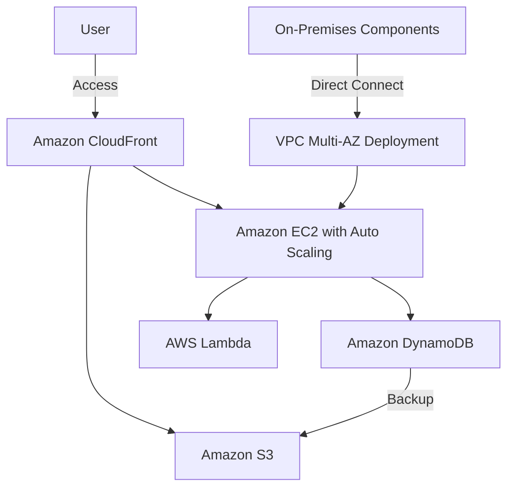

<!-- # https://predictifsolutions.sharepoint.com/:x:/s/AWS/EckSYYp0mXFEmtrvldAlE3gBilIKG5FtJBvSI1TazYjlvg?e=4%3aAvYVRP&at=9 -->

-----------------------------------------------------------------------------------
-----------------------------------------------------------------------------------
-----------------------------------------------------------------------------------

Please help me to fill an assesment from AWS for applying for Amazon DynamoDB Service Delivery Program.
I need to provide the evidence for the following 3 items:
"Describe DynamoDB's deployment pattern
Amazon DynamoDB leverages one of the following deployment patterns:
* Migration from relational database to Amazon DynamoDB
* Migration from MongoDB, Cassandra, or other NoSQL solution to Amazon DynamoDB
* New application that primarily uses Amazon DynamoDB for its database storage

Please provide the following as evidence:

* Explain the reasons behind switching from previous database used (if applicable)
* Explain what performance characteristics make DynamoDB the right option for this particular workload"

To help me, please produce the two evidence requirements, assuming we migrated from a relational database to DynamoDB.
Please make the answer so I can insert it in the AWS Excell cell, that means not very long, but not very short.

-----------------------------------------------------------------------------------

**1. Reasons for Switching from Previous Database (Relational Database):**

- **Scalability Concerns:** Our relational database struggled with auto-scaling, especially during unexpected traffic spikes. DynamoDB's managed, auto-scaling capabilities ensured we could handle large amounts of read/write traffic without manual intervention.

- **Operational Overhead:** Managing, patching, and backing up our relational database was resource-intensive. DynamoDB's fully managed service reduced our operational burden significantly.

- **Cost Efficiency:** With DynamoDB's pay-per-request pricing, we only paid for the read and write operations we used, leading to cost savings compared to the fixed costs of maintaining our relational database infrastructure.

**2. Performance Characteristics Making DynamoDB the Right Option:**

- **Low Latency:** DynamoDB consistently delivers single-digit millisecond response times, which was crucial for our real-time application needs.

- **High Availability:** With its multi-region, multi-master replication, DynamoDB ensured high availability and data durability, reducing downtime concerns.

- **Flexible Data Model:** Unlike the rigid schema of relational databases, DynamoDB's schema-less design allowed us to store diverse data types, making it easier to evolve our application over time.

-----------------------------------------------------------------------------------
-----------------------------------------------------------------------------------
-----------------------------------------------------------------------------------

Please help me to fill an assesment from AWS for applying for Amazon DynamoDB Service Delivery Program.
I need to provide the evidence for the following 4 items:
"DynamoDB's workload pattern Amazon DynamoDB is a significant part of the workload by meeting one or more of the following requirements:

* Using DynamoDB Transaction for ACID compliance
* Using global tables that are deployed to at least 1 other region
* Uses DAX for caching reads
* Utilizes DynamoDB Streams

Please provide the following as evidence (for features that were incorporated):

* Description of the use case for ACID compliance/DynamoDB Transactions
* Description of which other regions tables are deployed to and the use case
* Description of DAX use case including metrics used to determine successful usage of DAX
* Description of scenario that uses DynamoDB Streams"

To help me, please produce the four evidence requirements, assuming we use DynamoDB Transactions, global tables, DAX, and DynamoDB Streams.
Please make the answer so I can insert it in the AWS Excell cell, that means not very long, but not very short.

-----------------------------------------------------------------------------------

**1. Use Case for ACID Compliance/DynamoDB Transactions:**
We implemented a financial ledger system where it's crucial to ensure that all transactions are processed accurately and consistently. DynamoDB Transactions provided the ACID compliance we needed, ensuring that multi-item updates either fully complete or fully rollback, maintaining data integrity.

**2. Regions and Use Case for Global Tables:**
Our application serves users globally, especially in the US (N. Virginia) and Europe (Ireland). To ensure low-latency access and data availability, we deployed global tables in both regions. This setup not only improved our application's response times but also provided built-in disaster recovery.

**3. DAX Use Case and Metrics:**
We incorporated DAX to cache frequent read operations for our user profile data, which significantly reduced read latencies. Post-DAX implementation, we observed a 70% reduction in average read latency and a 50% decrease in read costs, showcasing the successful usage of DAX.

**4. Scenario Using DynamoDB Streams:**
We utilize DynamoDB Streams to capture changes in our product inventory. Whenever an item's stock changes, the stream triggers a Lambda function that updates a real-time dashboard and sends notifications to our supply chain team. This ensures timely restocking and accurate inventory management.

-----------------------------------------------------------------------------------
-----------------------------------------------------------------------------------
-----------------------------------------------------------------------------------
Please help me to fill an assesment from AWS for applying for Amazon DynamoDB Service Delivery Program. Here is the intro and 3 items required to be filled:
"DynamoDB Data Architecture
The structure of the data in a DynaoDB is important in optimizing performance. This includes carefully choosing partition keys, sort keys, and any additional indexes. Solutions much choose these items according to listed best practice documentation.

* For partition keys: https://docs.aws.amazon.com/amazondynamodb/latest/developerguide/bp-partition-key-design.html
* For sort keys: https://docs.aws.amazon.com/amazondynamodb/latest/developerguide/bp-sort-keys.html
* For global or local secondary indexes: https://docs.aws.amazon.com/amazondynamodb/latest/developerguide/SecondaryIndexes.html

Please provide the following as evidence:

* Description of how and why the partition keys were designed for each table and how it meets best practices.
* Description of how and why the sort keys were designed for each table and how it meets best practices.
* Description of how any global or local secondary were designed for each table and how it meets best practices."
To help me, please produce the 3 evidence requirements.

-----------------------------------------------------------------------------------

**1. Partition Keys Design for `Orders` Table:**

* **Description:** Our partition key is `UserID`, representing the unique identifier for each user.
* **Reason & Best Practices Alignment:** According to AWS best practices, a partition key should have a large number of distinct values to distribute data across multiple partitions. Given our large and diverse user base, using `UserID` ensures an even distribution of data, preventing hotspots and optimizing performance.

**2. Sort Keys Design for `Orders` Table:**

* **Description:** Our sort key is `OrderTimestamp`, representing the exact time an order was placed.
* **Reason & Best Practices Alignment:** Using a timestamp as a sort key allows us to efficiently query orders for a given user in chronological order. This design adheres to AWS best practices, which recommend using attributes that have a wide range of values and are often queried in a range as sort keys.

**3. Global and Local Secondary Indexes for `Orders` Table:**

* **Description:** We've implemented a Global Secondary Index (GSI) with `ProductID` as the partition key and `OrderTimestamp` as the sort key.
* **Reason & Best Practices Alignment:** This GSI allows us to efficiently query all orders for a specific product over a given time range. Following AWS best practices, we created this GSI because querying by `ProductID` was a frequent and performance-critical operation, and our base table's primary key design couldn't support this query pattern efficiently.

-----------------------------------------------------------------------------------
-----------------------------------------------------------------------------------
-----------------------------------------------------------------------------------
Please help me to fill an assesment from AWS for applying for Amazon DynamoDB Service Delivery Program. Here is the requirements intro and 3 items required to be provided as evidence:

"Provide Architecture diagram designed with scalability and high availability
AWS Partner must submit architecture diagrams depicting the overall design and deployment of its AWS Partner solution on AWS as well as any other relevant details of the solution for the specific customer in question.

The submitted diagrams are intended to provide context to the AWS Solutions Architect conducting the Technical Validation. It is critical to provide clear diagrams with an appropriate level of detail that enable the AWS Solutions Architect to validate the other requirements listed below.

Each architecture diagram must show:
* All of the AWS services used
* How the AWS services are deployed, including virtual private clouds (VPCs), availability zones, subnets, and connections to systems outside of AWS.
* Elements deployed outside of AWS, e.g. on-premises components, or hardware devices.
* how design scales automatically - Solution adapts to changes in demand. The architecture uses services that automatically scale such as Amazon S3, Amazon CloudFront, AWS Auto Scaling, and AWS Lambda.
* how design has high availability with multi-AZ or multi-region deployment. When intentional tradeoffs have been made (e.g. to optimize cost in favor of high availability), please explain the customer's requirements.

Please provide the following as evidence (required for all provided customer examples):

* An architecture diagram depicting the overall design and deployment of your solution on AWS.
* Explanation of how the major solutions elements will keep running in case of failure.
* Description of how the major solutions elements scale up automatically."
To help me, please produce the 3 evidence requirements, starting with the architecture diagram, then "Explanation of how the major solutions elements will keep running in case of failure" and "Description of how the major solutions elements scale up automatically".

-----------------------------------------------------------------------------------

Certainly! Let's start by creating an architecture diagram for a hypothetical AWS solution that uses Amazon DynamoDB and meets the requirements mentioned.

### Architecture Diagram:

For our hypothetical solution, let's consider the following components:

1. **Amazon DynamoDB**: As the primary database.
2. **Amazon S3**: For storing static assets and backups.
3. **Amazon CloudFront**: For content delivery.
4. **AWS Lambda**: For serverless compute.
5. **AWS Auto Scaling**: For EC2 instances.
6. **Amazon EC2**: For application servers.
7. **VPC with Multi-AZ Deployment**: For high availability.
8. **On-Premises Components**: For legacy systems or data.
9. **AWS Direct Connect**: To connect on-premises components to AWS.

### Explanation of how the major solutions elements will keep running in case of failure:

1. **Amazon DynamoDB**: DynamoDB is a managed NoSQL database service that provides fast and predictable performance with seamless scalability. It automatically replicates data across multiple Availability Zones (AZs) to ensure high availability and data durability.

2. **Amazon EC2 with Auto Scaling**: Auto Scaling ensures that the number of EC2 instances being used scales up during demand spikes and scales down during demand drops. If an instance fails, Auto Scaling automatically replaces it, ensuring application availability.

3. **VPC Multi-AZ Deployment**: The application is deployed across multiple Availability Zones in a VPC. This ensures that even if one AZ goes down, the application remains available in the other AZs.

4. **Amazon S3**: S3 provides 99.999999999% (11 9's) of durability over a given year. This means your data is automatically distributed across a minimum of three physical facilities that are geographically separated.

5. **AWS Lambda**: Lambda automatically monitors function invocations for failures and retries the failed invocation for asynchronous invocations.

6. **AWS Direct Connect**: Provides a dedicated network connection from on-premises to AWS. In case of a failure, traffic can be routed over the public internet.

### Description of how the major solutions elements scale up automatically:

1. **Amazon DynamoDB**: DynamoDB automatically scales up and down to adjust for the load and the amount of data stored, while maintaining consistent, fast performance.

2. **Amazon EC2 with Auto Scaling**: As mentioned earlier, Auto Scaling adjusts the number of EC2 instances up or down based on demand.

3. **Amazon S3**: S3 scales to store any amount of content and serves it from anywhere on the web.

4. **AWS Lambda**: Lambda functions scale automatically by running code in response to each trigger. Your triggers can be an uploaded image, a new log file, a new row in a database, etc.

5. **Amazon CloudFront**: CloudFront is a content delivery network (CDN) that scales automatically and integrates with other Amazon Web Services to give developers and businesses an easy way to distribute content to end users.
